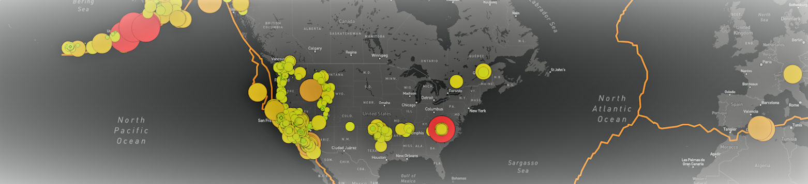

# Mapping Earthquakes
## Project Overview
- This analysis project provides a mapping visualizatoin of GeoJSON data of Earquakes within the past 7 days. Visualization in includes locations, magnitudes, techtonic plate location on Earth. 
    -  JavaScript,Leaflet, HTML, and CSS Bootstrap were utilzed in this project. GeoJSON data provided by USGS.
